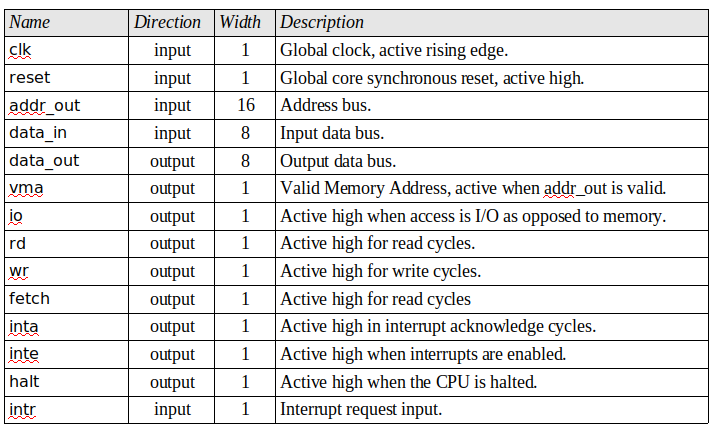

# Resumo - apresentacao 1:
- CPU Interface:

# Simulação RTL:

    objetivo da simulacao RTL - provar que a descriçao RTL esta correta
    baixaremos a descriçao RTL pronta no opencores
    deve ter um arquivo .vhd para o test bench e outro com a descrição
    busca_padrao.vhd -> descriçao do processador
    busca_padrao.sdc -> timing
    5 entradas
    testaremos cada parte do circuito

## Após abrir o VNC Viewer:

~~~shell
    # so a primeira vez
    wget www.inf.pucrs.br/moraes/testa_padrao.tar

    cd testa_padrao/sim/rtl
    tcsh
    source /scripts/set_cadence.csh
    source /scripts/set_cadence_innovus161.csh

    nclaunch &
    # exit em janela que abrir

    cd ../sim/rtl
    irun -f file_list.f # editar esse arquivo?
    # design browser - conterá arquivos projeto
    # UUT - unidade de teste
    # puxar variaveis para compilar o tb:
        # seleciona variável e clica em waveform

    # abra o console sim vision
    run 12us
    # ajusta zoom '='
    # keep this range
        # start time: 11.2us
        # end time:   11.8us
    # em time - seleciona intervalo criado
    # é o tb que define como serão as formas de onda

    # para simular novamente apos modificar - no console - sim vision
    irun -clean
    run 12us

    # se aparecer as formas de onda significa que funcionou
    # fechar: file -> exit
~~~

